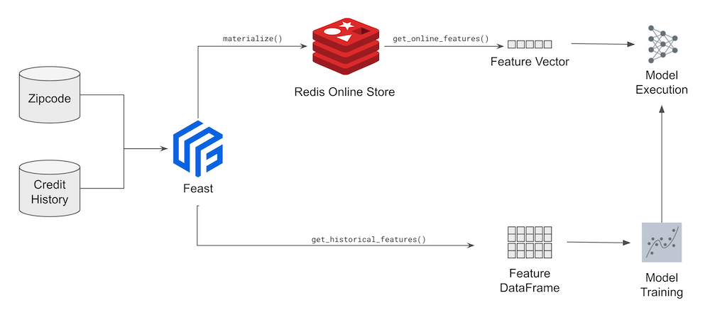
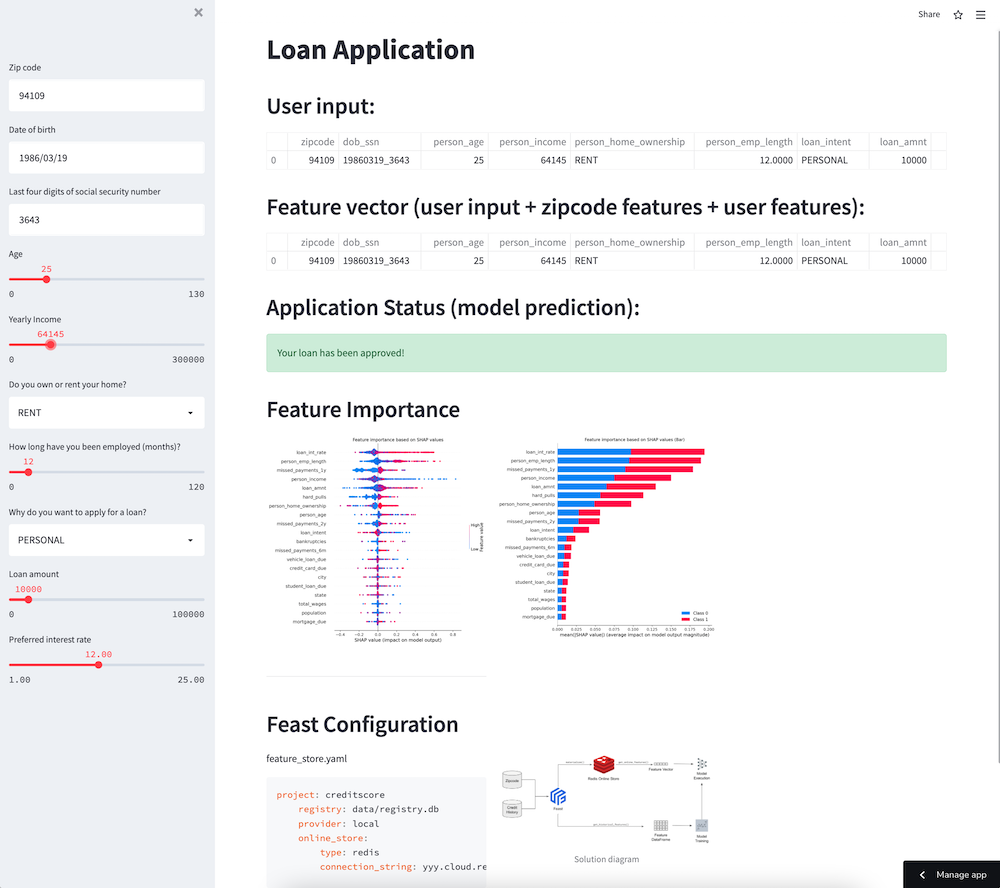

# Feast + Redis demo application

Adaptation of https://github.com/feast-dev/feast-aws-credit-scoring-tutorial using Redis as Online Store and default local files as Offline Store.


## Live demo

Live demo of this app, using [Streamlit Cloud](https://streamlit.io/cloud) and [Redis Cloud](https://app.redislabs.com/#/login)

https://share.streamlit.io/antonum/feast-redis/main




## Setup 

Install feast/redis:
```
pip install 'feast[redis]'
```
Init feast repo
```
export REDIS_ENDPOINT = "localhost:6379"

feast -c creditscore apply
```
Materialize features to Redis
```
CURRENT_TIME=$(date -u +"%Y-%m-%dT%H:%M:%S")
feast -c creditscore materialize-incremental $CURRENT_TIME
```
The command would fill in online Redis store with the data from the offline store (parquet files).

## Exploring the data/code

Data is located at creditscore/data folder in parquet files. 

`creditscore/data/credit_history.parquet` and `creditscore/data/zipcode_table.parquet` contain data of the offline store. In production use it would likely be data warehouse data sources such as Snowflake or BigQuery.

`creditscore/features.py` contains feature definitions for Feast. Changes to this file would affect what features from the data sources are avaliable and are populated to the online store.

`creditscore/feature_store.yaml` is the main feature store definition file. It contains provider specification (aws/gcp or local) and definitions for the Online and Offline feature store. This is where you specify your Redis endpoint. In this demo we replace `localhost:6379` with `${REDIS_ENDPOINT}` so it can be specified securely in the environment like Streamlit cloud, using the environment variable and point to always on instance on Redis Cloud.

```yaml
project: creditscore
registry: data/registry.db
provider: local
online_store:
    type: redis
    connection_string: localhost:6379
```

`feature_store.yaml` along with `features.py` are two key elements of the Feast feature store and must be defined for any feature store project. All the others are dependent on the provider and the specifics of machine learning model implementation.

`creditscore/data/loan_table.parquet` is a labeled input data and used only for training the model.

Most of the Machine Learning code is located at `credit_model.py`. It interacts with Feast:
```python
# init feast object, based on the path to the feature_store.yaml
self.fs = feast.FeatureStore(repo_path="creditscore/")

# retreive training features from Offline datastore
training_df = self.fs.get_historical_features(...)

# retreive feature vector from the online feature store for inference
return self.fs.get_online_features(...)

```

## Train the model

```
python run.py
```
As you can see - run.py is just a shell. Most of the model and Feast-related code is in the `credit_model.py` file.

This demo uses sklearn `DecisionTreeClassifier` machine learning model and `shap` library to visualize the Feature Importance.

If pretrained model already found, this code would just run a simple test, by doing inference on the sample input. If mopdel is not found - it would request features from the offline store using `get_historical_features()`. This request would return a dataframe, based on the Offline store content (parquet files for this demo).

With the model in place, `get_online_feature()` would retreive features from the online store Redis in the same format as the dataframe returned by `get_historical_features()`, but significantly faster.

## Interactive demo

To launch the browser-based interactive demo run:
```
streamlit run streamlit_app.py
```

This would launch a web application at http://localhost:8501. Try to change values in the web form, such as `Yearly Income` or `Preferred interest rate`. App would query additional values from Redis and recalculate the credit eligbility.

## Monitoring Redis backend

To see how Feast interacts with Redis in real-time connect to your Redis endpoint using separate terminal and run MONITOR command.
```
 ~ redis-cli
127.0.0.1:6379> MONITOR
OK
19:19:09.369 [0 70.111.111.111:49372] "HMGET" "\x02\x00\x00\x00zipcode\x04\..."_ts:zipcode_features"
19:19:09.397 [0 70.111.111.111:49372] "HMGET" "\x02\x00\x00\x00dob_ssn\x02\..."_ts:credit_history"
```
## Redis Connection override for Streamlit
In order to store connection string/password in streamlit secrets, you can override redis connection string.

Local use - add file `.streamlit/secrets.toml` with the following content:
```
REDIS_ENDPOINT = "yyy.cloud.redislabs.com:14783,password=xxx"
```

Alternatevely you can use environment variable:
```
export REDIS_ENDPOINT = "yyy.cloud.redislabs.com:14783,password=xxx"
```
For Streamlit Cloud - add the same string to the project secrets.